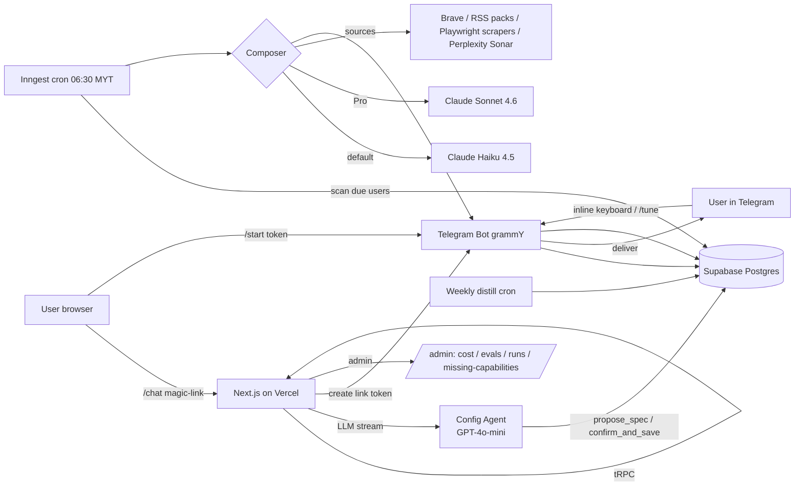

# Cadence — Handover Doc v1

**Owner:** Faeez (faeezmnoor@gmail.com, Asia/Kuala_Lumpur, solo founder)
**Co-founder agent:** `cadence-cofounder`
**Last updated:** 2026-06-09
**Status:** **Paid-GA ready on the engineering side.** All Pro-tier alpha tickets shipped, eval gate live but blocked on `READY=false, reason=no_data` (0 Pro briefs ever rated). Phase 6a closed out — every implementation ticket (CAD-157..164) Done; the old duplicate epic CAD-113..121 swept to Canceled. Two user-side blockers remain: (a) Stripe MY KYC, (b) Faeez running ≥25 blinded Pro ratings to clear the eval gate.
**Reading time for a cold pickup:** 25–30 min. If you only have 10, read sections 1, 5, 8, 11, 12.

---

## 1. TL;DR (read this if nothing else)

**What:** Cadence is a periodical, self-learning market-research digest service. Users configure a "brief" via a web chat with an AI agent, link their Telegram, and start receiving a daily/weekly/monthly brief tuned to *their* exact industry. The brief learns from feedback (👍/👎/`/tune <text>`) and gets sharper over weeks.

**Positioning (NEVER mis-state this):** *"Your own market researcher at a fraction of the cost."* Do **not** lead with Telegram — Telegram is a delivery channel, not the value prop. WhatsApp is on the roadmap and validated users actually prefer it.

**Where it is today:**
- Web app live at `cadence-web-bice.vercel.app` (custom domain pending — `cadence.news` is the front-runner).
- Phase 1–4 (MVP) shipped: magic-link auth, chat-config wedge, Telegram linkage, scheduled cron delivery at 06:30 MYT, feedback loop with `/tune`, weekly distill into `distilled_prefs`.
- Phase 5 (monetization) shipped the credit ledger, 4 pack tiers, billing UI, low-balance nudges, refund/admin grant tooling. **Stripe checkout is NOT live** — Faeez's Stripe MY KYC is the open blocker.
- Phase 5.1 (Pro tier — Sonar Reasoning Pro + Sonnet 4.6) is engineering-complete and gated behind `PRO_TIER_ALPHA`. Eval gate at `server/evals/pro-eval-gate.ts` is live and reports `READY=false, reason=no_data` — needs ≥25 Pro briefs + blinded ratings before public toggle.
- Phase 6a (free-data-source plan — Playwright scrapers + curated RSS packs) is **fully shipped**. Tickets CAD-157..164: 7 Done, 1 Backlog (CAD-162 deferred — composer-time TOPIC_KEYWORDS router handles topic routing implicitly; user-facing pack suggester is scope creep).
- No paying users yet. Two validated commodity-SME design partners on standby for first paid checkout.

**Three things any new owner MUST know before touching code:**
1. **Cadence is a nested git repo at `/home/abd_f/.openclaw/workspace/cadence/app`** — the outer workspace has planning files (`blueprint/`, `strategy/`, `BRIEF.md`, etc.) that are NOT part of the deployed code. `cd cadence/app` before running anything. Sub-agents that miss this die.
2. **Cadence ≠ LiveWheel.** Different project, different stack decisions, different ICP, different Notion tree. Never blend the two.
3. **The chat-config wedge + self-learning loop is the moat — not the data or the channel.** Every architectural decision should preserve those two surfaces' agility. Treat the rest as commodity.

---

## 2. Product overview

### One-sentence pitch
Cadence is your own market researcher — fully customizable to your industry, delivered to the messaging app you already check, at a fraction of the cost of a junior analyst.

### What Cadence IS
- A **chat-based AI configuration** flow on web that produces a structured `DigestSpec` JSON.
- A **periodical digest engine** that fetches sources, composes a Telegram-safe brief, delivers it, captures feedback, and self-learns.
- A **multi-tenant, multi-industry** product. Marketing is currently narrowed to 3 anchor ICPs (commodity SMEs, B2B ops leads, solo advisors), but the product itself supports any industry the chat-config can capture.
- A **pay-per-use, credit-based** SaaS. No subscriptions. 1 credit = 1 default brief; 3 credits = 1 Pro brief.

### What Cadence is NOT (anti-positioning)
- **Not a Bloomberg / equity-research replacement.** No real-time prices, no analyst estimates, no fundamentals depth.
- **Not a flight or hotel price tracker.** Different product mechanic (threshold alert ≠ periodic digest). Deferred to a "Cadence Alerts" surface, if ever.
- **Not a generic newsfeed or news aggregator.** It's a *synthesized brief*, not raw items.
- **Not a "Telegram bot."** Telegram is one delivery channel of several planned. Marketing copy must not lead with it.
- **Not a chat assistant.** The chat *configures the brief*; users do not converse with Cadence daily inside the chat surface.
- **Not a subscription product.** No auto-renewals. Credits never expire.

### Core user flows

**Flow A — First-time signup → first brief live**
1. Land on `/` → "Get your own daily brief." CTA → Supabase magic-link auth (or Google OAuth).
2. Redirect into `/chat`. Config agent (GPT-4o-mini today; CAD-74 plans to bump to a newer model) asks 4–6 questions to capture industry, topics, cadence, delivery time, language, data add-ons.
3. Agent emits a draft `DigestSpec` (Zod-validated JSON). UI shows spec sidebar (desktop) or `<details>` disclosure (mobile).
4. User confirms → `confirm_and_save` tool call persists a new version to `digest_specs` → routes to `/app/link`.
5. `/app/link` shows the deep-link CTA → user taps → opens `t.me/<bot>?start=<token>` → user sends `/start` → server resolves token, sets `telegram_chat_id`, fires a **sample brief** immediately.
6. Sample brief arrives in Telegram within ~30–90s. Real scheduled briefs begin the next morning at the chosen local time (default 06:30 MYT).

**Flow B — Daily delivery + feedback (the heart of the product)**
1. Inngest cron fires every minute, scans `users` for due deliveries by `(state='active', timezone, delivery_time_local)`.
2. For each due user: load current `DigestSpec`, load distilled prefs + last 5 raw notes, fetch sources in parallel (Brave search legacy / RSS packs / Playwright scrapers / Perplexity Sonar Reasoning Pro on Pro tier), compose via Claude Haiku 4.5 (default) or Sonnet 4.6 (Pro), render markdown → split if needed → send to Telegram chat with inline keyboard (👍 👎 🎯 💤), optionally TTS voice note.
3. User taps button → callback handler writes `feedback_events`; or replies `/tune <text>` → writes `learning_log`.
4. Weekly `learning.distill` cron condenses raw log into ≤5 stable bullets → `users.distilled_prefs` → composer reads on next run.

**Flow C — Reconfigure / pause / cancel**
- Web: `/chat` (re-enter with current spec loaded), `/spec` (JSON editor, behind disclosure), `/settings/billing` (top-up + history), `/settings/learning` ("what I've learned about you"), `/settings/danger` (PDPA-compliant delete).
- Telegram: `/pause`, `/resume`, `/sample` (rate-limited 3/day), `/tune <text>`.

### The "self-learning" mechanic (explained)
This is Cadence's moat. The mechanism in pieces:
1. **Feedback events.** Every brief delivered carries inline buttons → callbacks write `feedback_events(user_id, digest_run_id, signal_type)`.
2. **Tune signal.** Replying `/tune <text>` or even a short freeform reply (planned heuristic per UX audit §3) writes a row to `learning_log` with `source='tune_command'`.
3. **Distill.** Weekly Inngest cron `learning.distill` calls Claude Haiku to condense the last N raw notes into ≤5 stable preference bullets → `users.distilled_prefs` jsonb.
4. **Composer injection.** Every brief composer call injects `distilled_prefs` + last 5 raw notes into the system prompt template (`apps/web/server/ai/composer/prompt.ts`).
5. **Eval.** Per-spec eval harness exists (`/admin/evals`). Pro tier ships only after a blinded golden-set scoring shows Pro mean ≥ default mean + 1σ.

### Positioning rules (locked)
- **DO** lead with "your own market researcher / industry researcher at a fraction of the cost."
- **DO** mention Telegram only as a delivery detail, in passing.
- **DO NOT** position as "AI Telegram bot for market news" or any variant of channel-first framing.
- **DO** anchor copy in three ICPs (commodity SME / B2B ops / solo advisor) per PM audit §4.
- **DO NOT** promise flight/hotel/equity-depth coverage. Per the stack-gap audit, these are not credible today.
- **DO** keep the *product* industry-agnostic even while marketing narrows.

---

## 3. Personas & ICPs

The full taxonomy lives in `cadence/strategy/pm-icp-and-usecases-v1.md` §1. Faeez's directive (per free-data-source-plan-v1 §0) is to **keep the wider ICP surface in the product** even if marketing narrows. Summary:

| # | ICP | WTP/mo | Channel pref | Stack fit today | GA narrative? | First-brief example |
|---|-----|--------|--------------|-----------------|---------------|---------------------|
| 1 | **Commodity-exposed SME owner** (palm oil / chicken / wheat) | $25–100 | WhatsApp > TG | ✅ Full | **YES (anchor)** | "Palm oil daily: MPOB + CPO futures + Bernama Agri" |
| 2 | **B2B operator** at vertical SaaS / mid-market | $10–25 | Slack > TG | ✅ Full | **YES** | "Weekly competitor watch on [vertical] — pricing, launches, hires" |
| 3 | **Solo consultant/advisor** (legal, tax, medical, accounting) | $25–50 | Email > WA | ✅ Full | **YES** | "Weekly MY tax circulars + LHDN alerts + Big-4 RSS" |
| 4 | Sales/BD pro tracking target accounts | $25–50 | Email > Slack | ✅ Data, ⚠️ channel | Soft yes | "Pre-meeting brief on [Account] — last 7 days news + hires" |
| 5 | Researcher / journalist / analyst | $10–25 personal / $100+ inst | Email | ⚠️ Partial (RSS depth) | With caveats | "Daily beat brief: [topic] across primary sources + translated press" |
| 6 | Niche enthusiast (sneakers, watches, sports, crypto) | $10–25 | TG native | ⚠️ Per-vertical | Phase 6 verticals | "EPL weekend preview" / "Crypto airdrop watch" |
| 7 | Retail equities investor | $25–100 | Email + TG | ❌ Stack gap at depth | NO at GA | "Daily watchlist news (5–10 tickers) + earnings flag" |
| 8 | Frequent traveller / flight hacker | $5–10 | TG fine | ❌ Stack gap | NO at GA (separate product) | "KL→TYO under RM 1,800 watch" |
| 9 | Government / tender watcher | $50–500 | Email | ❌ Stack gap | NO at GA (Phase 6c) | "Daily MY tender notices: ePerolehan + MyProcurement" |
| 10 | Recruiter / talent watcher | $25–50 | Email + Slack | ⚠️ News-mention only | NO at GA | "Weekly exec-moves brief at target companies" |

**The wider ICP surface IS supported by the product** — chat-config is industry-agnostic. The narrowing is purely a *marketing-copy* decision. Per Faeez's override, do not strip ICPs 4–10 out of the product. The escape valve on the landing page is "Watch literally anything else? Try a custom brief →".

---

## 4. Tech stack & architecture

### The stack
| Layer | Choice | Notes |
|---|---|---|
| Frontend | **Next.js 15.5 (App Router)** + React 19 RC + TypeScript | Server components + tRPC client. |
| UI | **Tailwind + shadcn/ui + Radix UI** | Wordmark + coral brand accent landed in brand-v2. |
| API | **tRPC v11** | Type-safe end-to-end; lives at `apps/web/app/api/trpc/[trpc]`. |
| DB | **Supabase Postgres (Singapore)** project `ezhlrawimuryundpmtpm` | RLS on all user-scoped tables. |
| Auth | **Supabase Auth** — magic link via Resend, plus Google OAuth | 30-day sessions. |
| ORM | **Drizzle ORM** + Drizzle Kit migrations | Schema in `apps/web/server/db/schema.ts`. |
| Background jobs | **Inngest** cloud (free tier) | Cron + retries + queue. Functions live in `server/inngest/`. |
| LLM gateway | **Vercel AI SDK** | One API across providers. |
| Composer (default) | **Claude Haiku 4.5** (`claude-haiku-4-5-20251001`) | Cheap, ~$0.014/brief in tokens. |
| Composer (Pro) | **Claude Sonnet 4.6** | 1M-context flat rate, ~$0.07/brief in tokens. |
| Search (legacy default) | **Brave Search API** | **Brave killed free tier 2026-02-12.** Existing grandfathered key still works; treat as deprecated. DuckDuckGo HTML scrape is the planned successor (Phase 6b). |
| Search (Pro) | **Perplexity Sonar Reasoning Pro** | Multi-step reasoning, ~$0.04/brief. |
| RSS | `rss-parser` + curated packs (Phase 6a) | Hourly Inngest refresh. |
| Scrapers | `playwright-core` + `@sparticuz/chromium` + stealth | Phase 6a; first wave: MPOB, Bursa, BNM, SC, LHDN, USDA WASDE. |
| Prices | **yfinance** Python sidecar on Fly.io | Free, fragile. Considered stable enough for ICP-1 light pricing. |
| Telegram | **grammY** TS framework | Webhook on `/api/telegram/webhook?secret=...`. |
| Voice (TTS) | Edge TTS (Andrew voice, ~3min) | Per UX audit §3 — settings toggle planned. Default ON. |
| Email | **Resend** | Magic-link + transactional. |
| Hosting | **Vercel** (web) + **Fly.io** (yfinance) + **Inngest cloud** (jobs) | Zero ops. |
| Observability | **Sentry** + **Axiom** | Sentry wired but **DSN may not be set in prod — flag for verification** (`SENTRY_DSN` env var). Axiom dataset `cadence`. |
| Payments | **Stripe Checkout (hosted)** — pending MY KYC | Hard-blocked on Faeez's KYC. Pre-Stripe ledger & UI are live. |
| Repo | pnpm 11 monorepo at `cadence/app` | `apps/web` (Next.js) + `services/prices` (Python). |

### Architecture diagram (Mermaid)


### Request flow — daily digest
1. `cron.scheduler` Inngest fn fires every minute → scans `users` for due delivery (`state='active'`, `timezone` + `delivery_time_local` matches now).
2. For each due user, enqueues `digest.run` event.
3. `digest.run` handler:
   - Load current `DigestSpec` row + `distilled_prefs` + last 5 raw `learning_log`.
   - Resolve sources via the **source router** (`server/sources/index.ts`) — selects providers per tier (default = Brave + RSS + scrapers; Pro = + Perplexity Sonar).
   - Compose via `server/ai/composer/compose.ts` — emits JSON, validated by `schema.ts`, rendered by `render.ts` into Telegram Markdown.
   - Split if >3800 chars, send to Telegram with inline keyboard, optionally generate + send voice note.
   - Atomically debit 1 (default) or 3 (Pro) credits via `transactions` row; record `cost_to_us_micro_usd`.
   - Write `digest_runs(status='delivered', telegram_message_id, sources_bundle, composed_markdown, cost_usd)`.
4. On failure: Inngest retries 3× exponential. Pro briefs auto-fallback to default + refund 2 credits.

### Per-layer responsibilities (where the code lives)
- `apps/web/app/(marketing)/` — landing, pricing, how-it-works, privacy, terms.
- `apps/web/app/chat/` — config chat UI (streaming via Vercel AI SDK `useChat`).
- `apps/web/app/spec/` — read-only spec summary + JSON editor.
- `apps/web/app/app/link/` — Telegram link page.
- `apps/web/app/settings/{billing,learning,danger}/` — user account surfaces.
- `apps/web/app/admin/{cost,evals,feedback,missing-capabilities,runs}/` — operator-only dashboards.
- `apps/web/app/b/[shortId]/` — public brief permalink (`noindex`).
- `apps/web/app/api/telegram/webhook/` — grammY webhook.
- `apps/web/server/ai/{composer,config-agent,distill,providers}/` — all LLM logic.
- `apps/web/server/sources/{rss,scrape}/` + `connectors/` — data ingestion.
- `apps/web/server/digest/{run,share,streak,sample-banner}.ts` — digest lifecycle.
- `apps/web/server/billing/` — credit ledger + Stripe (when live).
- `apps/web/server/inngest/` — cron + queue handlers.
- `apps/web/server/eval/`, `server/evals/` — eval harness.
- `apps/web/server/db/{schema.ts, apply-XXXX.mjs, seed-pricing-snapshots.mjs}` — Drizzle + migration runners.

---

## 5. Current state — Phase scoreboard

### Phase 0–4 (MVP foundation through feedback loop): **DONE**
Ticket-map says 72 of 84 tracked tickets `Done`. Highlights:
- **P0 Foundation:** monorepo, Next.js, Vercel autodeploy, Supabase, magic-link auth, tRPC v11, Inngest, Drizzle schema for all MVP tables, RLS, CI typecheck/lint. (T-001 → T-012 all done.)
- **P1 Config wedge:** landing, auth UI, `/chat` streaming, config-agent prompt v1, all 5 tools (`propose_spec`, `update_spec_field`, `ask_user`, `confirm_and_save`, `add_rss_feed`), DigestSpec Zod schema, thread persistence, `/spec` view, config-agent eval harness. (T-101 → T-111 all done.)
- **P2 Telegram + manual digest:** Telegram bot registered, grammY webhook with secret verification, link-token flow, Brave search connector + `source_cache`, yfinance Fly.io service, RSS connector, JSON-then-render composer, formatter+splitter, `sampleNow` mutation, `digest.run` handler, `cost_events` tracking. (T-201 → T-212 — T-207 marked `Todo` historically but RSS *is* shipped via Phase 6a path; T-206 yfinance was deferred but is now live.)
- **P3 Scheduled delivery:** tz-aware minute cron, idempotency on `(user_id, run_date)`, 3× retry + `delivery_broken` flag, `/admin/runs` listing, `replayRun`. (T-301 → T-306 done. Faeez's 14-day dogfood streak is the launch gate per QUEUED-WORK.md #1.)
- **P4 Feedback loop:** inline keyboard, callback → `feedback_events`, `/tune` command, composer prompt injection, weekly distill function, eval harness. (T-401–T-405, T-407 done. T-406 — bot echo confirmation — **Canceled** because the per-UX-audit "got it, what was off?" follow-up is the better pattern and is being respec'd.)

### Phase 5 (monetization base): **DONE**
Pre-paid credit ledger live, dogfooded on Faeez's spec. Schema: `users.credits_balance + cost_to_us_micro_usd + country_code + trial_credits_granted_at`, `transactions` table, `pricing_snapshots` table. UI: `/settings/billing` with balance hero, packs grid (currently disabled — "coming soon"), ledger with mobile card-stack. Low-balance Telegram nudges shipping at <7/<3/0-credit thresholds. Admin grant tool works. **Stripe Checkout itself is NOT live — KYC blocked.**

### Phase 5.1 (Pro tier — Sonar Reasoning Pro + Sonnet 4.6, 3-cr multiplier): **engineering-complete; user-side eval gate blocks public exposure**
Per `project_cadence_pro_tier` memory. Epic = CAD-100. As of 2026-06-09 (post Linear reconciliation):
- **CAD-90 / T-525** Eval gate code shipped at `server/evals/pro-eval-gate.ts`. Verdict today: `READY=false, reason=no_data` (0 Pro runs lifetime, 0 manual ratings ever).
- **CAD-94..97, CAD-101, CAD-102** all moved Backlog → Done after code audit (Pro burn-rate dashboard, billing/spec/pricing tier explainers, provider timeouts, `PRO_TIER_ALPHA` flag + safety-net downgrade, cost-overrun circuit breaker, Pro→default refund-2-credit fallback).
- **Still Backlog (truly open):** CAD-91 (T-526 public toggle exposure — gated on eval pass), CAD-93 (T-528 per-account default-to-Pro), CAD-99 (T-534 landing copy + `/pro` tour).

Pro is behind `PRO_TIER_ALPHA=true` env flag and admin-grant-only. **The gate is now Faeez's time to dogfood + rate Pro briefs, not engineering.**

### Phase 5.2 (BYO API Keys): **DEFERRED**
PRD locked at `strategy/byo-keys-prd-v1.md`. Epic = CAD-103. 6 tickets queued, all `Backlog`. Defer trigger: 50 paying users on Phase 5.1.

### Phase 6 (free data sources): **6a DONE, 6b queued, 6c gated**
- **Phase 6a (Patterns A+C — Playwright scrapers + RSS packs).** Implementation tickets CAD-157..164. **Status: closed out.** CAD-157/158/159/160/161/163/164 all Done in code: Playwright + `@sparticuz/chromium` + stealth installed, scraper framework + `NormalizedSourceItem` schema, MPOB / Bursa CPO / Yahoo Finance scrapers, RSS aggregator + 17 curated feeds across commodities/Malaysia/regulatory/tech/crypto, `source_cache` table + RLS lockdown, `gatherSources` composer wire-in (`apps/web/server/sources/index.ts`). **CAD-162 (ICP auto-detect → suggest pack)** deferred — composer-time TOPIC_KEYWORDS router already routes implicitly; user-facing pack suggester is scope creep beyond paid-GA. **The old duplicate epic CAD-113 + CAD-114..121 was Canceled on 2026-06-09** because CAD-157..164 are the real tickets.
- **Phase 6b (Pattern B SERP + extra connectors).** Tickets CAD-165..171. All `Backlog`. Includes DuckDuckGo HTML scrape (Brave free-tier successor — highest-leverage), CoinGecko Demo API, eBay Browse API, The Odds API, Kiwi Tequila affiliate, per-company Google News RSS, scraper health dashboard.
- **Phase 6c (residential proxy + hard targets).** Tickets CAD-172..176. All `Backlog`. Gated on >100 paid Pro users (~$3k MRR).

### Open work elsewhere (from `ticket-map.json`)
Pre-Phase-5 leftovers still marked `Todo`/`Backlog` (probably superseded by newer work — verify before picking up):
- T-206 (CAD-29) yfinance Fly.io — actually shipped, ticket-map snapshot stale.
- T-408–T-415 (CAD-70–CAD-77) — chat-UX hardening tickets, several already incorporated into chat-ux-v2 lock; check before re-implementing.
- CAD-78 — "Move trial grant to signup" — small `Todo`.

### Faeez's queued non-ticketed work (per `cadence/QUEUED-WORK.md`)
1. Chat agent additive-request refusal (prompt-only change after Stream A merges).
2. **Brief-quality dogfood gate** — 14 consecutive personal briefs at quality bar (no JSON failures, no source dropouts ≥2/day, no personalization regressions) **BEFORE public signup opens.** Non-negotiable launch gate.
3. Composer Telegram-footer to append `<share_url>` from getBriefShareUrl(shortId).
4. Mobile-responsive pass across `/chat`, `/spec`, `/app/link`, `/settings/*`, `/admin/*`.

---

## 6. Monetization

### Model (locked 2026-06-02)
**Pre-paid credits.** 1 credit = 1 default brief delivered. 3 credits = 1 Pro brief. No subscriptions. Credits never expire. `/tune` and feedback button taps are **free forever** (protects the self-learning loop).

### Pack ladder
| Pack | Credits | USD | MYR | $/credit | Margin (vs $0.04 cost) |
|---|---|---|---|---|---|
| Taste | 30 | $5 | RM23 | $0.167 | 76% |
| Standard | 70 | $10 | RM47 | $0.143 | 72% |
| Power | 200 | $25 | RM118 | $0.125 | 72% |
| Pro pack | 1000 | $100 | RM470 | $0.10 | 60% |

All four packs clear the 60% gross-margin discipline floor. Display currency is geo-detected (MYR for `country_code='MY'`); v1 charges in USD via Stripe with FX snapshot; v2 (MYR native) gated on Stripe MY KYC + MYR settlement.

### Trial: **3 free credits**, one-shot per user, granted after first brief delivery (not at signup). Brief 1 must demonstrate specificity, Brief 2 demonstrate self-learning, Brief 3 close with paywall preview of next brief.

### Launch gates (G1–G7)
- **G1** Credit ledger in prod, 7-day Faeez dogfood. ✅
- **G2** Trial grant fires + trial content passes checklist. In progress.
- **G3** `/settings/billing` UI renders. ✅
- **G4** Stripe Checkout webhook idempotently credits. **❌ Blocked on Faeez KYC.**
- **G5** Low-balance Telegram nudges. ✅ (text-only minimum).
- **G6** Final-brief paywall with preview-of-next. In progress.
- **G7** Refund policy text written + linked. Pending Faeez.

### What's free forever
`/tune` taps, feedback buttons, weekly distill output, signup/spec config/admin UI, trial briefs 1–3, re-deliveries on our failure.

---

## 7. Open questions / unblocked decisions

Aggregated across all PRDs/audits. Each line: **decision** → *default if Faeez doesn't choose* → *impact of getting it wrong*.

### From `pm-icp-and-usecases-v1.md` §7
1. Drop travel + equity-investor ICPs from GA marketing? → *Default: drop from copy, keep in product* → *Wrong: stack-honesty problem at GA.*
2. Channel sequencing — TG only at GA or wait for WhatsApp? → *Default: TG at GA, WhatsApp 30-day fast-follow* → *Wrong: lose ICP-1 conversion to channel friction.*
3. Lead landing with commodity-SME or stay industry-agnostic? → *Default: lead with commodity SME, keep product agnostic* → *Wrong: top-of-funnel dilution.*
4. Interview 2 ICP-2 + 2 ICP-3 prospects pre-GA? → *Default: yes, do it in next 14 days* → *Wrong: GA narrative rests on assumption.*
5. Post-GA next-adapter sequence (a/b/c)? → *Default: (a) GDELT + curated RSS first, then (c) gov tenders* → *Wrong: build the wrong thing first.*

### From `ux-experience-audit-v1.md` §10
1. Are ICPs 7/8 (equity-depth, flights) in scope for paid GA? → *Default: no, mark "supported, not featured"* → *Wrong: design system has to support shapes it can't credibly fill.*
2. Voice note (Andrew TTS) — default ON or OFF? → *Default: ON for morning-delivery users (07:00–08:30), OFF otherwise; settings toggle* → *Wrong: bandwidth tax + cost on users who don't want it.*
3. Domain lock (cadence.news vs alternative)? → *Default: cadence.news* → *Wrong: trust hit at paid GA on vercel.app subdomain.*
4. Sample-brief explicit framing as "Sample brief" with banner? → *Default: yes, banner header* → *Wrong: user thinks "this is just the same brief again."*
5. Mock a state-machine spec for "one chip strip at a time"? → *Default: yes, as a follow-on UX delivery* → *Wrong: chat overload kills trial conversion.*

### From `pro-tier-prd-v1.md` §Open questions
1. 3-cr multiplier confirmed? → *Default: 3× until 50 paying Pro users, then test 2×* → *Wrong: margin compression at scale.*
2. Stack B (Sonar Reasoning Pro + Sonnet 4.6) vs Stack D (Sonar Pro + GPT-5)? → *Default: Stack B (chosen)* → *Wrong: pay 20% more than needed.*
3. Second eval scorer beyond Faeez? → *Default: validated palm-oil trader from May interviews* → *Wrong: bias in eval, Pro ships on vibes.*
4. Pro available on 3-credit trial? → *Default: no, locked* → *Wrong: trains users to expect free Pro.*
5. Pro alpha user gift — admin_grant or promo code? → *Default: promo code (cleaner audit)* → *Wrong: messy refund ledger.*
6. Publish "≤60s" latency SLA? → *Default: no, just say "best research quality, takes a bit longer"* → *Wrong: SLA exposure.*

### From `byo-keys-prd-v1.md` §Open questions
1. Discount on credit packs for hybrid users? → *Default: no, keep binary* → *Wrong: mental-model overhead.*
2. Org-level BYO (one team key)? → *Default: defer to Phase 6 team billing* → *Wrong: scope creep.*
3. Promotional launch post? → *Default: quiet launch, no marketing* → *Wrong: cannibalize credit revenue.*

### From `monetization-strategy-v1.md` §8
1. Auto-topup at v1 or v1.5? → *Default: v1.5* → *Wrong: build before validating once-paid.*
2. Pro $100 pack public or invite? → *Default: public* → *Wrong: leave money on table.*
3. MYR rounding — exact or RM 0.50? → *Default: round to RM 0.50, store exact in DB* → *Wrong: "RM23.47" looks unprofessional.*
4. Launch promo credits via plumbing or manual admin_grant? → *Default: manual* → *Wrong: build plumbing nobody uses.*
5. Refund posture pre-50-users? → *Default: pro-user via manual email* → *Wrong: chargeback exposure.*
6. Sanity-check pack naming (Taste/Standard/Power/Pro)? → *Default: keep* → *Wrong: receipt copy looks weird.*
7. Charge from beta day 1? → *Default: yes; admin_grant thank-you after first paid topup* → *Wrong: validated WTP unproven.*

### From `free-data-source-plan-v1.md` §10 Questions
1. Drop hotels entirely from GA narrative? → *Default: drop, revisit >100 paid users* → *Wrong: GA promise we can't keep on Booking anti-bot.*
2. Residential proxy spend gate (>100 paid Pro users / ~$3k MRR)? → *Default: agreed* → *Wrong: bleed $50–250/mo before MRR justifies it.*
3. Pattern E transparency-footer wording — review before ship? → *Default: ship draft as-is* → *Wrong: trust signal lands wrong.*

---

## 8. Runbook — "how do I do X"

> All paths absolute unless stated. App lives at `/home/abd_f/.openclaw/workspace/cadence/app`. **Always `cd` there before pnpm/npm/git commands** — outer workspace is planning-only.

### Add a new digest spec template
1. Edit `apps/web/server/ai/config-agent/templates.ts` (verify path; check `prompts/` if not found).
2. Add a starter-spec object matching `DigestSpec` Zod schema (`server/ai/composer/schema.ts` or `server/db/schema.ts`).
3. Register the starter chip in the chat UI's starter-chips array (`apps/web/components/chat/*`).
4. Run `npx vitest run` — eval harness will catch spec-shape regressions.

### Add a new RSS source
1. Edit the curated-packs JSON config (Phase 6a — `apps/web/server/sources/rss/packs.json` or equivalent). Add `{ url, label, pack_id, language }`.
2. No code change needed — Inngest `feeds.refresh` cron polls every 15min, writes to `feed_items` table.
3. ICP auto-detect (Phase 6a #6) should pick it up if `pack_id` is mapped to an industry keyword.

### Add a new Playwright scraper
1. Create `apps/web/server/sources/scrape/<source-name>/index.ts` exporting `fetch(): Promise<NormalizedSourceItem[]>` + a selector spec object.
2. Match the `NormalizedSourceItem` Zod schema (lock contract — defined in CAD-113 child).
3. Wire into the source-router (`server/sources/index.ts`).
4. Sentry alert fires automatically on zero-row fetch.

### Wire a new provider into the abstraction layer
1. Define provider in `apps/web/server/ai/providers/<name>.ts` implementing the `Provider` interface (`providers/types.ts`).
2. Register in `providers/index.ts`.
3. Provider switching is driven by tier: see `providers/default.ts` (Haiku) and `providers/anthropic-pro.ts` (Sonnet) for reference. Perplexity Sonar is at `providers/perplexity.ts`.

### Apply a Supabase migration
The repo uses **runner scripts** named `apply-XXXX.mjs` (sequential numbering). Pattern:
```bash
cd /home/abd_f/.openclaw/workspace/cadence/app
# Generate (after schema.ts edit):
pnpm db:generate
# Apply with service-role key from .env.local:
node apps/web/server/db/apply-0023.mjs  # use the actual new number
```
Each migration runner is one logical change; **never edit an applied migration** — write a new `apply-NNNN.mjs`.

### Flip the Pro tier alpha flag
```bash
# In Vercel env (Production):
PRO_TIER_ALPHA=true  # accepted opt-in: "1" or "true". Anything else routes Pro requests through default.
```
Redeploy. The Pro toggle appears in `/chat` above the input. **Do NOT flip without first verifying eval-gate scoring in `/admin/evals`.**

### Read the admin dashboards
- `/admin/cost` — per-user $/brief, lifetime cost, margin per user.
- `/admin/evals` — golden-set scoring board for Pro tier eval gate.
- `/admin/runs` — last 100 digest runs across all users; click any row to inspect spec/sources/markdown/error; "Replay" re-runs composer with snapshot.
- `/admin/feedback` — recent feedback events stream.
- `/admin/missing-capabilities` — config-agent hits where the agent couldn't satisfy a user request (use to find Phase 6 opportunities).

Email allowlist gates these — see `apps/web/lib/auth-admin.ts` or similar; current allow = `faeezmnoor@gmail.com`.

### Manually grant credits / refund a user
1. `/admin` → user lookup by email or telegram_chat_id.
2. "Grant credits" form → enter integer + reason → writes `transactions(type='admin_grant', credits_delta=+N, metadata={reason})`.
3. Refund: same form with `credits_delta=-N` + `type='refund'`. UI confirms; ledger reconciles.
4. For Stripe-cleared refunds (post-KYC), do the Stripe-side refund first, then admin_grant compensating credits.

### Roll back a bad deploy
- Vercel dashboard → Deployments → previous green deploy → "Promote to Production." Sub-1-min revert.
- Database migrations: NOT auto-reverted by Vercel. If the bad deploy ran a migration, write a forward-fix `apply-NNNN.mjs` (do NOT manually edit a past migration).

### Investigate a stuck/broken user
1. `/admin/runs?user_email=<email>` — see last 10 runs + status.
2. If `status='failed'`, inspect `error` column + Sentry event by user_id tag.
3. If `users.state='delivery_broken'`, check Telegram `getUpdates` — most common cause is the user blocked the bot. Flip state to `active` after they unblock.
4. If composer JSON parse failed (`ComposerJsonError`), the run is auto-retried 3×; persistent failures usually mean Haiku output drift — bump the model in `server/ai/providers/default.ts` or tighten the system prompt.

---

## 9. Glossary

- **Brief / digest** — a single delivered Telegram message generated by Cadence for a user. Billable unit.
- **DigestSpec** — Zod-validated JSON describing one user's brief preferences (industry, topics, cadence, language, etc.). Stored versioned in `digest_specs`. Latest version per user has `is_current=true`.
- **Spec** — short for DigestSpec.
- **Config agent** — the LLM (GPT-4o-mini) running the chat-config flow. Calls tools (`propose_spec`, `update_spec_field`, `ask_user`, `confirm_and_save`, `add_rss_feed`).
- **Composer** — the LLM (Haiku default, Sonnet Pro) that turns spec + sources + feedback memory into the final Telegram-safe brief markdown.
- **Default tier** — the standard $0.10–0.17/brief stack: Brave/RSS/scrapers + Haiku 4.5. 1 credit per brief.
- **Pro tier** — the "Deep research" stack: Perplexity Sonar Reasoning Pro + Sonnet 4.6. 3 credits per brief. Eval-gated.
- **Pro pack** — the highest credit pack ($100 for 1000 credits). NOT the same as Pro tier — naming hazard. UI uses "🔬 Deep research" for the tier; "Pro pack" only on the billing page.
- **Trial credits** — 3 free credits granted to each new user once, after first brief delivery.
- **Tune signal / `/tune`** — user feedback delivered via the `/tune <text>` Telegram command or a freeform short reply.
- **Feedback event** — structured signal from inline keyboard tap (👍/👎/🎯/💤). Written to `feedback_events`.
- **Learning log** — table of raw user-feedback notes. Source can be `tune_command`, `feedback_event`, or `distilled`.
- **Distilled prefs** — ≤5 stable preference bullets condensed weekly from the learning log; stored as jsonb on `users.distilled_prefs`.
- **Distill cron** — `learning.distill` Inngest function. Runs weekly per user.
- **Cadence cron** — `cron.scheduler` Inngest function. Runs every minute, fans out due users.
- **Run / digest run** — one execution of the digest pipeline for one user on one date. Idempotent on `(user_id, run_date)`.
- **Source bundle** — snapshot of all sources (search results, RSS items, prices, Sonar response) fetched for one run. Stored in `digest_runs.sources_bundle`.
- **Source resolve rate** — % of sources that returned data (not zero rows). Tracked for scraper-health alerting.
- **Fallback / downgrade** — when Pro tier providers fail, the run auto-routes to default tier + refunds 2 credits.
- **Sample brief** — the on-demand first brief sent immediately after Telegram linkage. Per UX audit, should carry a "✨ Sample brief — your real briefs land at 07:00 daily" banner.
- **Manual rating** — Faeez's eval-gate scoring of briefs on the 5-point rubric (accuracy / depth / actionability / freshness / readability).
- **Eval gate** — blocking quality bar Pro must clear (Pro mean ≥ default mean + 1σ on blinded golden set) before public toggle exposure.
- **Pattern A/B/C/D/E** — the five source-fetch patterns from free-data-source-plan-v1: Playwright scraper, SERP scrape, RSS aggregator, Perplexity Sonar, LLM-only-with-transparency.
- **Streak** — count of consecutive days the user received a brief without missing. Surfaced in the brief footer post-Phase 6a.
- **Curated RSS pack** — named bundle of RSS feeds keyed to an industry (e.g., `commodity-sme-my`, `ops-saas`, `crypto`). Auto-attached by ICP detection.
- **Link token** — single-use, 15-min-TTL Crockford base32 12-char token used in the Telegram deep-link `t.me/<bot>?start=<token>`.
- **Bill_to_user** — visible ledger in credits (and display currency). What the user sees.
- **Cost_to_us_micro_usd** — hidden COGS in micro-USD (1e-6). Operator-only.
- **`delivery_broken`** — `users.state` flag set after 3 consecutive Telegram send failures. Disables further attempts.
- **G1–G7** — the 7 launch-gating conditions from monetization-strategy-v1 §7.
- **MUST-SHIP** — Faeez-tagged tickets that block public signup opening. Tracked in QUEUED-WORK.md.

---

## 10. People & external accounts

- **Faeez Noor** — `faeezmnoor@gmail.com`, KL (`Asia/Kuala_Lumpur`), solo founder. Main project = LiveWheel; Cadence is the side-income project.
- **Vercel** — project `cadence-web-bice` → `cadence-web-bice.vercel.app`. Custom domain target: **cadence.news** (pending).
- **Supabase** — project ref `ezhlrawimuryundpmtpm`, Singapore region. PITR upgrade pending (see `blueprint/operational-runbook.md` §1).
- **Linear** — team `CAD`, team ID `9453dad3-e027-4db7-89ad-21f488a36b4a`. Issues at `https://linear.app/faeezmnoor/issue/CAD-N/...`.
- **Notion** — Cadence root: https://www.notion.so/36f2fa6da5b881c48485d1568ea808a9. Children include Validation & Customer Discovery DB, Roadmap & Ideas DB, Engineering Backlog DB. Strategy docs live under "Cadence > Strategy."
- **Telegram bot** — `@FaeezOpenClaw_bot`. **RENAME BEFORE LAUNCH** — current handle is placeholder. Webhook secret: `4b0be1aebc21bc7448360b73bb542dbd4074b9796701234accaebff66a1d043f`.
- **Inngest** — cloud free tier. Functions auto-discovered via `/api/inngest`.
- **Fly.io** — yfinance Python sidecar (machine size 256MB, ~$0–3/mo).
- **Stripe** — account in MY KYC review. Test mode usable; production blocked.
- **Resend** — magic-link + transactional email.

### External API keys (set in Vercel env + local `.env.local`)
- `ANTHROPIC_API_KEY` (Haiku + Sonnet)
- `OPENAI_API_KEY` (config agent)
- `PERPLEXITY_API_KEY` (Pro tier search)
- `RESEND_API_KEY` + `EMAIL_FROM`
- `TELEGRAM_BOT_TOKEN` + `TELEGRAM_WEBHOOK_SECRET` + `BOT_USERNAME`
- `BRAVE_SEARCH_API_KEY` (grandfathered free tier — treat as deprecated)
- `SUPABASE_SERVICE_ROLE_KEY` + `NEXT_PUBLIC_SUPABASE_*`
- `DATABASE_URL` + `DIRECT_URL`
- `INNGEST_EVENT_KEY` + `INNGEST_SIGNING_KEY`
- `SENTRY_DSN` + `NEXT_PUBLIC_SENTRY_DSN` — **verify these are set in prod**; flagged uncertain.
- `AXIOM_TOKEN` + `AXIOM_DATASET=cadence`
- `PRO_TIER_ALPHA` (boolean string)
- `NEXT_PUBLIC_APP_URL`

All secrets canonically live in `~/.openclaw/secrets.env` chmod 600 per `reference_secrets_env` memory. Do NOT scatter into `~/.config/openclaw/*.env`.

---

## 11. What to ship next (priority order)

The opinionated co-founder sequence — do these in this order:

1. **Stripe MY KYC + checkout flow** (G4). Single biggest revenue blocker. Faeez completes KYC → wire Stripe Checkout webhook → run end-to-end test charge in prod → flip pack tiles from disabled to enabled → ship. Until this lands, every conversion is leaking through the "Email me to top up" banner.

2. **Pro tier eval gate dogfood** (user-side, Faeez). Code is done; data isn't. Eval gate at `server/evals/pro-eval-gate.ts` reports `READY=false, reason=no_data` — needs ≥25 Pro briefs paired with default-tier baselines + blinded rubric ratings before public Pro toggle (CAD-91/T-526) can ship. This is the single largest hold on going wide.

3. **Verify Sentry DSN in prod.** 30-minute check. If `SENTRY_DSN` isn't set in Vercel prod env, set it and confirm the next deploy emits a test error. Sentry is the only thing standing between Faeez and silent prod regressions when he's sleeping.

4. **Remaining truly-open Phase 5.1 Pro tier tickets** (after eval-gate data lands):
   - **CAD-91 / T-526** Public Pro toggle (depends on eval pass).
   - **CAD-93 / T-528** Per-account "default to Pro" toggle.
   - **CAD-99 / T-534** Landing Pro section + Telegram `/pro` tour.

5. **Phase 6b items in dependency order:**
   - DuckDuckGo HTML scrape (Pattern B) — the strategic Brave-free-tier successor.
   - Per-company Google News RSS auto-config — strengthens ICP-4/7 briefs at zero cost.
   - Scraper health dashboard (`/admin/scrapers`).
   - CoinGecko Demo / eBay Browse API / Kiwi Tequila / Odds API — order by which validated Pro user asks first.

6. **Domain (`cadence.news`) + custom email template + DNS lock.** UX audit §4 calls `cadence-web-bice.vercel.app` a paid-GA trust hit. Cheap fix, blocks GA copy.

7. **Top 7 P0 UX fixes from `ux-experience-audit-v1.md` §8.** All S/M-sized:
   - Live "crafting your first brief" progress card on `/app/link`.
   - Sample-brief banner header.
   - Replace "Top up — coming soon" with "Email me to top up" banner.
   - Telegram inline keyboard labels (Useful / Off / More on this / Pause 7d).
   - Chat one-chip-strip discipline rule.
   - `/spec` JSON behind a `<details>` toggle.
   - Brief template `sections: min 1` (allow quiet-day shape).

8. **Faeez's 14-day dogfood streak.** Before public signup opens. No JSON failures, no source dropouts ≥2/day, no personalization regressions. This is the launch gate, not a feature.

9. **WhatsApp channel POC.** ICP-1 validated users prefer WA; 30-day fast-follow after TG GA. Long pole is Meta Cloud API approval, not the integration.

10. **Phase 5.2 BYO Keys** — only after 50 paying users on Phase 5.1.

---

## 12. Known pitfalls — "if you see X, do Y"

- **pnpm 11 ignores postinstall builds.** If `playwright install` or `sharp` or `@sentry/cli` fail silently, check `pnpm-workspace.yaml` `onlyBuiltDependencies` list. Either add the package there or run `pnpm approve-builds`. Do NOT add a malformed `pnpm-workspace.yaml` as a workaround — it has bitten the repo before.

- **Notion Engineering Backlog `Status` is type `status`, not `select`.** Killed at least one agent (T-404 path). When writing via `ntn` CLI, use `--status` flag, not `--select`. Memory: `feedback_notion_status_property`.

- **Cadence app is a NESTED git repo at `cadence/app`.** Outer workspace `/home/abd_f/.openclaw/workspace/cadence` has planning files only. `cd cadence/app` for any code/pnpm/git operation. Sub-agents that skip this end up confused running git against the outer workspace. Memory: `feedback_cadence_nested_repo_path`.

- **Test runner — prefer `npx vitest run` if `pnpm test` wrapper hangs.** Known wrapper flakiness; direct invocation works.

- **Sub-agent Notion writes MUST use `ntn` CLI, not `NOTION_API_TOKEN`.** Memory: `feedback_subagent_notion_auth`. Token-based auth crashes silently in sub-agents because the keychain provider differs.

- **Brave Search free tier is dead (2026-02-12).** The grandfathered key still works but plan its replacement (DuckDuckGo scrape Phase 6b). Don't add Brave-based features without an exit plan.

- **Compaction model must stay at `opus-4-7`.** `opus-4-8` is not in the installed AI SDK registry — compaction breaks, context overflows. Memory: `feedback_compaction_model_registry`.

- **`@FaeezOpenClaw_bot` is NOT the production handle.** Rename pre-launch — appears in Telegram link CTAs and bot replies.

- **PITR is OFF on Supabase (free tier).** Per `blueprint/operational-runbook.md` §1, upgrade to Pro before accepting paid users. Without PITR, worst-case data loss is 24h.

- **Cadence Pro brief auto-fallback refunds 2 credits, not 3.** If Pro fails → falls back to default → charges 1 credit total. Don't refund 3.

- **`telegram_chat_id` is unique across users.** Re-signup with a different email but same Telegram account → blocked. This is the trial-grant abuse fence. Don't relax without a counter-fence.

- **OpenClaw gateway runs from global npm install, NOT `~/openclaw` git clone.** Upgrade via `npm i -g openclaw@latest`. Memory: `feedback_openclaw_install_layout`.

- **`apps/web/server/db/apply-NNNN.mjs` migrations are sequential and one-way.** Never edit a past one. Write a new forward-fix.

- **Faeez says "status?" in Telegram → run `patrick-status.sh`.** Don't interpret as a freeform question. Memory: `feedback_status_telegram_shortcut`.

- **Cadence ≠ LiveWheel.** This is *the* most-repeated rule in memory. Different dirs, different agents, different Notion, different Linear teams. If a request seems to conflate the two, stop and ask.

---

*End of handover. Living document — update sections as state changes. Mirror this file at `cadence/app/HANDOVER.md` for in-repo discoverability.*
