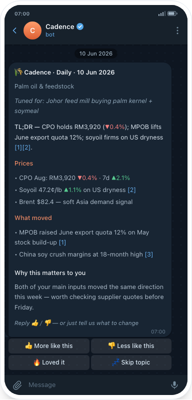
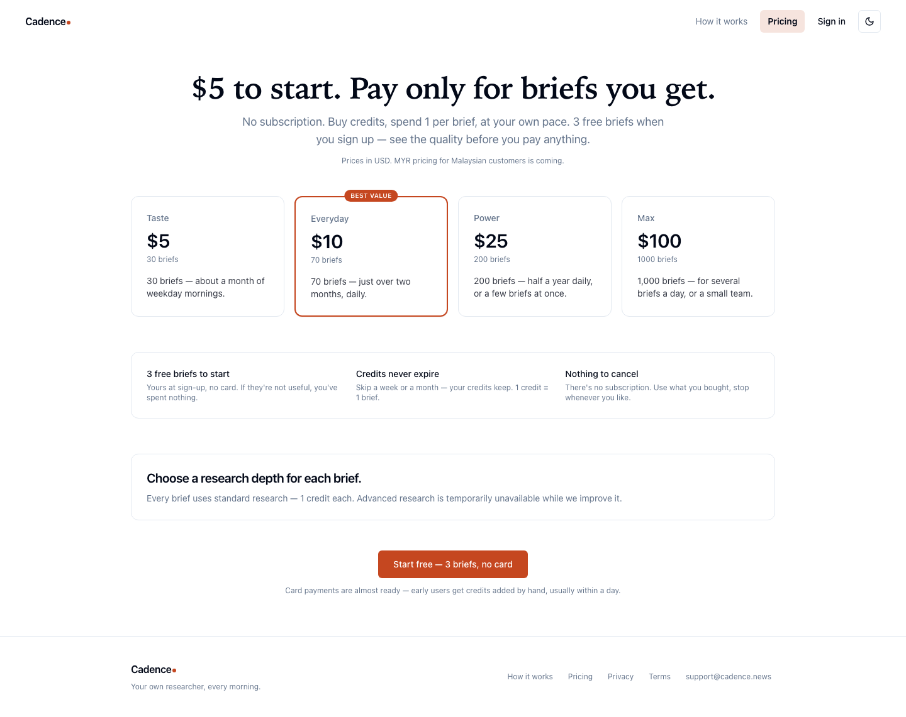

# Cadence

**A daily research agent for people whose work turns on one specific thing moving.**

[cadence-web-bice.vercel.app](https://cadence-web-bice.vercel.app)

A commodity price. A competitor. A regulation that changes what you can import.
You tell Cadence what matters in a web chat, link Telegram, and it researches
overnight and sends a short, sourced brief in the morning. Reply to it — 👍, 👎, or
`/tune` with a sentence — and the next one comes back closer to what you wanted.

---

## What a brief looks like

This one is written for a Johor feed mill buying palm kernel and soymeal.



Prices, then what moved, then the part that matters — *both of your main inputs
moved the same direction this week, worth checking supplier quotes before Friday.*
Everything above that line can be found in a dozen places. The sentence connecting
two price moves to **your** purchasing decision cannot.

The taps under it are the whole feedback loop: 👍, 👎, or `/tune` with a sentence.

## A brief is not a digest

A digest tells you what happened. A brief tells you what changed for you — and past
the first week they are different products, with different retrieval, different
ranking, and a different reason to open them.

A thousand users get a thousand different briefs, each shaped by what they asked
for and how they have replied since. It is not a newsletter with segments, and the
distinction is what the architecture is organised around. The reasoning is in
[`docs/decisions/0003-brief-not-digest.md`](docs/decisions/0003-brief-not-digest.md).

Telegram is where the brief lands, but the channel is deliberately kept out of the
pitch — it is a delivery detail, and the value has to survive being moved to
WhatsApp or email.

## How it works

```
web chat (config agent)  →  brief spec stored per user
                                  │
                    Inngest cron ─┤  tz-aware, ticks every 5 min
                                  ▼
        retrieve  →  compose (LLM)  →  render  →  Telegram
                                  │
                    👍 / 👎 / /tune ─┘  →  weekly distill → distilled_prefs
```

You never fill in a settings form. An agent interviews you, and what it produces is
a *brief* — the same noun as the thing that arrives, so there is nothing new to
learn between configuring it and reading it.

Each brief stores its own `next_run_at` as an exact scheduled instant rather than a
recurrence rule evaluated at run time, which is what lets briefs be paused, edited
mid-flight, or delivered late without a schedule drifting or colliding with itself.

Feedback is free forever and always will be. `/tune` and the reaction taps are what
make the product improve, and metering them would mean charging people to make it
better. Everything else is pre-paid credits that never expire — no subscription,
because a periodical product with variable value per issue makes a monthly charge
over-promise.



## Product decisions

Thirteen are written up in [`docs/decisions/`](docs/decisions/), including pricing
as pre-paid credits rather than a subscription (`0002`, `0008`), why research
collapsed from three tiers to two (`0006`), why the advanced tier ships turned off
(`0009`), and one rename that was tried and reversed (`0005`). Several supersede
each other and the amendment trail is intact, which makes them more useful than a
tidy set would be.

## Stack

Next.js 15 (App Router) · tRPC v11 · Drizzle ORM on Supabase Postgres · Inngest for
scheduling and background jobs · grammY for the Telegram webhook · Vercel AI SDK ·
Tailwind and shadcn/ui. Deployed on Vercel, pnpm workspace.

```
apps/web/          Next.js app, tRPC routers, brief pipeline, evals
services/prices/   Python yfinance sidecar
docs/              decisions, plans, runbooks, roadmap
```

## Local development

Node 20+, pnpm 9+.

```bash
pnpm install
cp apps/web/.env.example apps/web/.env.local   # fill in keys
pnpm dev                                        # → http://localhost:3000
```

`pnpm typecheck` · `pnpm lint` · `pnpm db:generate` (Drizzle migrations from schema
changes) · `pnpm db:migrate`.

The web app and chat config run without Telegram configured; the full delivery
pipeline needs a bot token and a model provider key.
