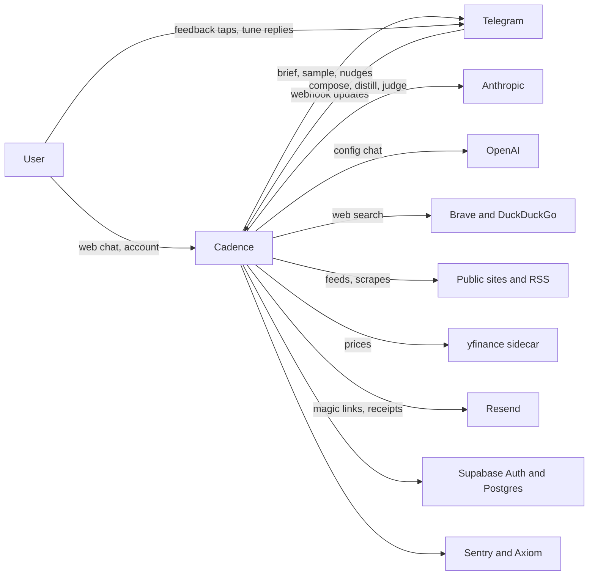
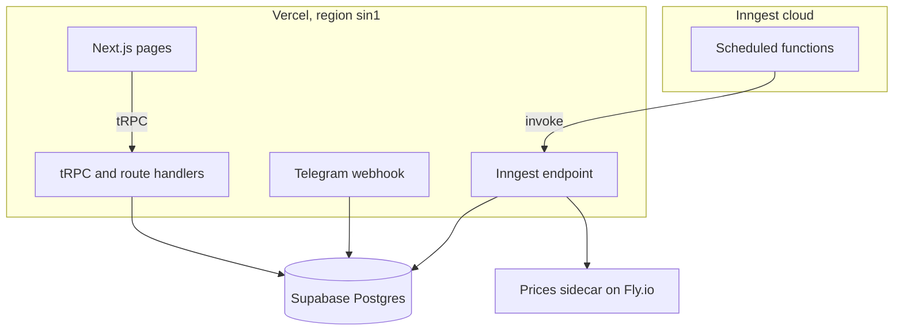
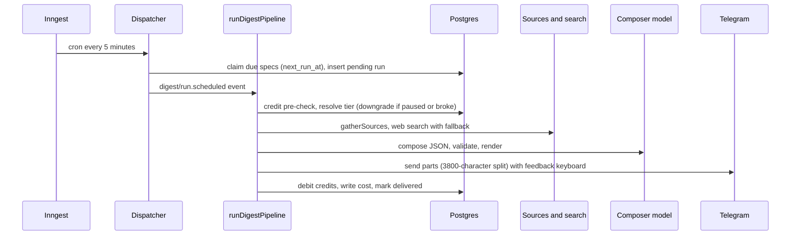
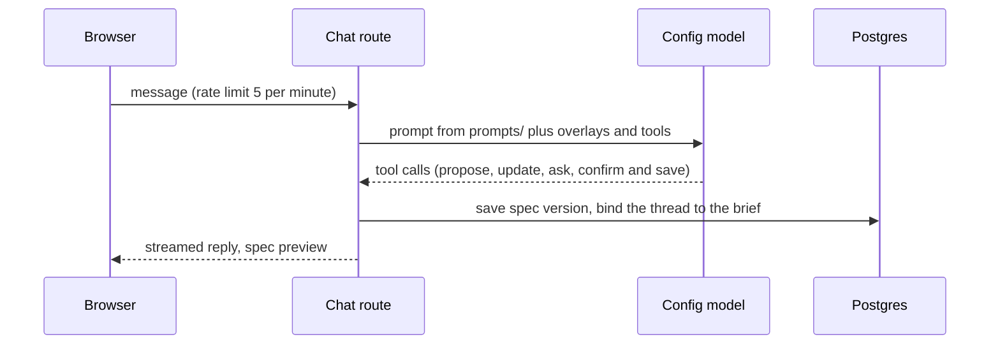
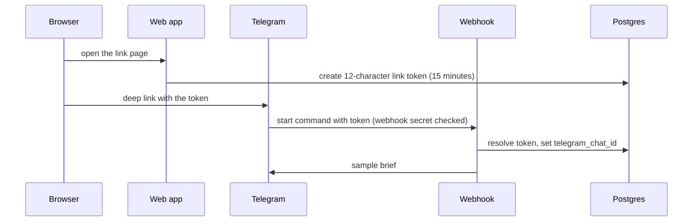
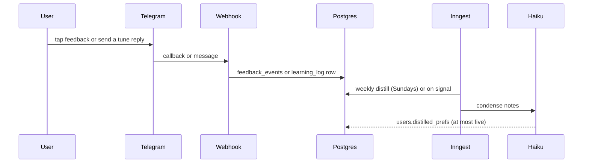

<!-- layer: knowledge · status: living (changes with boundaries, same PR) · verified: 2026-10-06 · budget: 300 lines -->
# Architecture — Cadence

## What it is
Cadence turns a chat conversation into a standing research brief and delivers it on a schedule. A Next.js app on Vercel hosts the chat, the account pages and the admin dashboards; Inngest runs the scheduler and the pipeline; Supabase Postgres holds users, specs, runs and the credit ledger; Telegram is the delivery channel. Product context: docs/product/brief.md. Drawn from the code on 2026-10-06 (commit 001508c); the old module notes are archived (docs/_archive/2026-10/, see the index).

## System context (C4 level 1)

- Telegram: outbound briefs and inline keyboards; inbound commands, feedback callbacks and tune replies via a secret-checked webhook.
- Anthropic: Claude Haiku 4.5 composes Standard briefs and distils preferences; Claude Sonnet 4.5 with the web-search tool composes Advanced briefs.
- OpenAI: gpt-4o-mini runs the configuration chat.
- Brave (grandfathered key) and DuckDuckGo (keyless fallback): web search per brief (decision 0011). Perplexity remains only in the bake-off harness.
- Public sites and RSS: 17 curated feeds and Playwright scrapers (MPOB, Bursa CPO, Yahoo Finance).
- yfinance sidecar on Fly.io: light price data. Resend: e-mail. Supabase: auth and the database. Sentry and Axiom: errors and logs.
- Stripe: not integrated yet (no dependency, no webhook); see docs/runbooks/stripe-skus-v2.md.

## Containers (C4 level 2)

| Container | Technology | Code | Deployed by |
| --- | --- | --- | --- |
| Web app (pages, chat, settings, admin) | Next.js 15 App Router, React, Tailwind, shadcn/ui | apps/web/app/, apps/web/components/ | Vercel on push to main |
| API | tRPC 11, route handlers, Zod | apps/web/server/trpc/, apps/web/app/api/ | Vercel |
| Pipeline and jobs | Inngest functions, Vercel AI SDK | apps/web/server/inngest/, server/digest/, server/ai/, server/sources/ | Vercel (Inngest calls the endpoint) |
| Telegram webhook | grammY, channel adapter | apps/web/app/api/telegram/webhook/, server/channels/telegram/ | Vercel |
| Database | Supabase Postgres, Drizzle ORM, SQL migrations with runners | apps/web/server/db/ | `apply-NNNN.mjs` runners (docs/runbooks/apply-migration.md) |
| Prices sidecar | Python, yfinance | services/prices/ | Fly.io |

### Where code lives (apps/web/server)
| Module | Holds |
| --- | --- |
| ai/composer | prompt, compose, JSON schema, render, feedback block, grounding check |
| ai/config-agent | chat tools, system prompt overlays, save and update spec, template seed |
| ai/distill | weekly preference distillation |
| ai/providers | tier routing (`getProviders`), searchers registry, Anthropic and Perplexity adapters |
| billing | credit cost, debit, refund, packs, grants, circuit breaker, low-balance footer |
| channels | `ChannelAdapter`; Telegram live; WhatsApp, Slack and e-mail scaffolds |
| chat | manage-mode thread lifecycle |
| connectors | legacy Brave search and RSS poller |
| cost | `record.ts`, the single `cost_events` writer |
| digest | `runDigestPipeline`, errors, share links, streaks, sample banner |
| eval, evals | feedback-loop evaluator; the Advanced readiness gate |
| inngest | client and scheduled functions |
| sources | `gatherSources`, curated feeds, scrapers, authority list |
| auth, rate-limit, supabase, support, observability, email, briefs, cron | admin allowlist, rate limiter, RLS-bound clients, support address, Sentry scrubbing, Resend client, brief listing, schedule matching |

## Subsystems (the pipeline's nine parts)
Each subsystem change reports a move-or-hold number on its golden set (decision 0012; skill cadence-eval). Path-scoped working rules live in .claude/rules/<name>.md.
| # | Subsystem | Code area | Metrics | Rules |
| --- | --- | --- | --- | --- |
| 1 | Research and search | server/sources/{rss,scrape}, server/connectors/, providers/{searchers,duckduckgo,perplexity}.ts | recall, precision, freshness, coverage per audience | research-search |
| 2 | Consolidation and ranking | server/sources/index.ts, authority.ts | duplicate rate, salience@k, freshness windows | retrieval-consolidation |
| 3 | Summarisation and composition | server/ai/composer/ | hybrid rubric composite, faithfulness, length | llm-composer |
| 4 | Multi-LLM providers | server/ai/providers/, server/cost/ | cost per brief, latency, quality per dollar | multi-llm-provider |
| 5 | Channels and delivery | server/channels/, app/api/telegram/ | delivery success, render fidelity, splits | channels-delivery |
| 6 | Content formats | composer render, channel formatters | format fidelity, cost per asset | content-format |
| 7 | Self-learning | server/ai/distill/, feedback and tune handlers | personalisation lift, distill stability | self-learning |
| 8 | Eval and quality | server/eval/, server/evals/pro-eval-gate.ts | golden-set coverage, judge-human agreement | specialist cadence-eval-quality |
| 9 | Agent runtime | server/digest/, server/inngest/, server/ai/config-agent/ | tool-call drift, fallback efficacy, cost ceiling | agent-harness |

## Key runtime flows
### Daily brief run (F-01)

Retries: three for transient errors, none for permanent ones (`classifyError`). A paused or unaffordable Advanced request runs as Standard and is charged as Standard.

### Chat configuration (F-02)

A thread with no spec is a setup thread; once saved it becomes that brief's manage thread (mode is derived, never stored; `MANAGE_MODE` is the kill switch).

### Telegram link and sample (F-03)

### Feedback and weekly distill (F-04)

## Data
Postgres on Supabase (Singapore). The generated tables, columns and relations are in docs/architecture/schema.md; the source is apps/web/server/db/schema.ts. Row-level security policies are hand-written SQL in apps/web/server/db/migrations/ (for example 0001, 0003 and 0019) and apply to the Supabase clients, not to Drizzle's service-role `db` (lesson L-03). Main groups: users and the credit ledger (`users.credits_balance`, `transactions`, `pricing_snapshots`); specs and runs (`digest_specs` versioned, `digest_runs` with the source bundle); learning (`feedback_events`, `learning_log`, `users.distilled_prefs`); chat (`chat_threads`); costs (`cost_events`); caches (`source_cache`, feed items). Retention: brief bodies of users soft-deleted for more than 30 days are purged daily. Backups: a nightly `pg_dump` artifact (db-backup.yml), currently failing (docs/OWNER-QUEUE.md); point-in-time recovery is off.

## Cross-cutting
- Auth and roles: Supabase Auth with magic links (Resend) and Google sign-in; tRPC `protectedProcedure` for users, `adminProcedure` for operators via the `CADENCE_ADMIN_EMAILS` allowlist (`server/auth/admin.ts`); no role column.
- Admin dashboards under `/admin`: cost, dispatch, evals (rate briefs, gate verdict), feedback, missing capabilities, runs (inspect and replay), users (grant credits).
- Configuration and secrets: values live in Vercel environment variables and the local apps/web/.env.local, never in documents. Names: `DATABASE_URL`, `DIRECT_URL`, `NEXT_PUBLIC_SUPABASE_URL`, `NEXT_PUBLIC_SUPABASE_ANON_KEY`, `SUPABASE_SERVICE_ROLE_KEY`, `ANTHROPIC_API_KEY`, `OPENAI_API_KEY`, `PERPLEXITY_API_KEY`, `BRAVE_SEARCH_API_KEY`, `RESEND_API_KEY`, `EMAIL_FROM`, `TELEGRAM_BOT_TOKEN`, `TELEGRAM_WEBHOOK_SECRET`, `BOT_USERNAME`, `ADMIN_TELEGRAM_CHAT_ID`, `INNGEST_EVENT_KEY`, `INNGEST_SIGNING_KEY`, `SENTRY_DSN`, `NEXT_PUBLIC_SENTRY_DSN`, `AXIOM_TOKEN`, `AXIOM_DATASET`, `NEXT_PUBLIC_APP_URL`, `CADENCE_ADMIN_EMAILS`, `MANAGE_MODE`, `PRO_TIER_ALPHA`. The support address is a constant in `server/support/contact.ts`. The GitHub Actions secret `DATABASE_URL` feeds the backup job.
- Errors and logging: pipeline errors are classified (`server/digest/errors.ts`) and sanitised before storage; structured logs via `lib/log.ts`; Sentry with a PII scrubber (`server/observability/sentry-scrub.ts`).
- Observability: Sentry (server, client, edge configs), Axiom logs, `cost_events` per paid call, a daily smoke summary to the owner's Telegram chat (docs/runbooks/SMOKE.md).
- Jobs (Inngest): dispatcher every 5 minutes; hourly RSS poll; daily feedback eval, smoke summary and soft-delete purge; weekly distill plus distill on signal.
- Flags: `PRO_TIER_ALPHA` (Advanced), `MANAGE_MODE` (brief manage threads), read only through `lib/feature-flags.ts`; a daily Advanced cost circuit breaker in `server/billing/circuit-breaker.ts`.
- Rate limits: `/api/chat` 5 turns per minute per user (`server/rate-limit/check.ts`).

## Environments and deploy path
| Environment | URL | Promoted by | Runbook |
| --- | --- | --- | --- |
| Local | localhost:3000 | `pnpm dev` | apps/web/README.md |
| Preview | per pull request on Vercel | opening a pull request | docs/runbooks/DEPLOY.md |
| Production | the Vercel production URL (custom domain pending) | merge to main (Vercel autodeploy) | docs/runbooks/DEPLOY.md |
| Prices sidecar | Fly.io app | manual deploy | services/prices/README.md |
- Vercel builds from the workspace root (`vercel.json`: `pnpm --filter web build`, region sin1). Inngest discovers functions at `/api/inngest`.
- Database changes ship separately through the runners; Vercel never runs migrations, and a rollback of code does not roll back a migration.
- CI (`.github/workflows/ci.yml`): job `check` runs install, typecheck, lint, tests and `pnpm audit --prod --audit-level=high`; job `standard-check` runs the documentation lint. Nightly `db-backup.yml` dumps the database.

## Constraints and debts
- The nightly backup fails because the `DATABASE_URL` Actions secret is unset (CAD-216; docs/OWNER-QUEUE.md).
- Point-in-time recovery is off on the Supabase plan; worst-case loss is a day (docs/OWNER-QUEUE.md).
- Brave runs on a grandfathered free key; DuckDuckGo is the fallback (decision 0011; CAD-228).
- Card checkout is not built: Stripe waits on KYC (docs/runbooks/stripe-skus-v2.md).
- Advanced composes with Claude Sonnet 4.5 in code (`PRO_COMPOSER_MODEL_ID`) while decision 0006 names Sonnet 4.6; the code is current, the decision text is not edited (superseding needs a new decision).
- No voice-note (TTS) code exists although older documents describe one (verified by search, 2026-10-06).
- `chat_threads.spec_id` is `ON DELETE SET NULL`: a future hard delete of a spec must also archive its thread in the same transaction, or the thread silently becomes a setup thread.
- The light surface token is pure white and no typeface is loaded (DESIGN.md, phase one).
- The dependency audit runs in CI as a blocking step since slice 002; new advisories fail `check`.

## Code map
Not generated at Standard tier; see "Where code lives" above and AGENTS.md §8.
