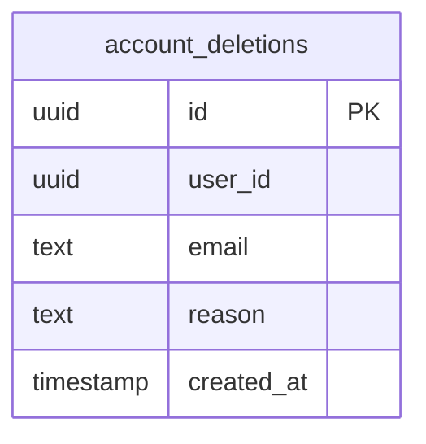
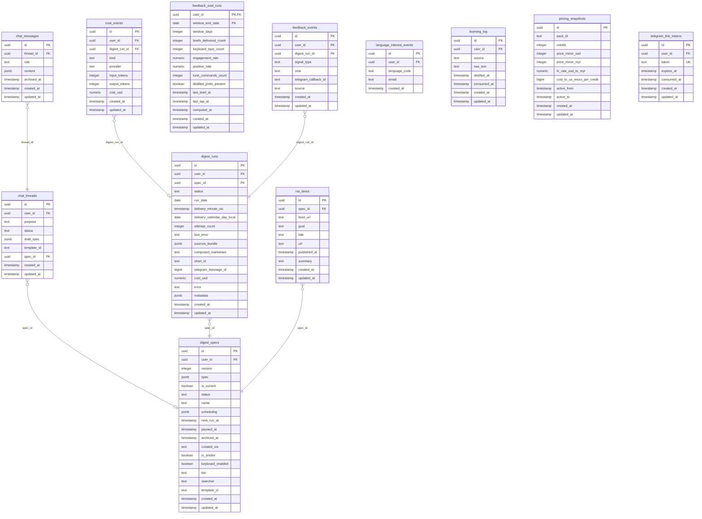
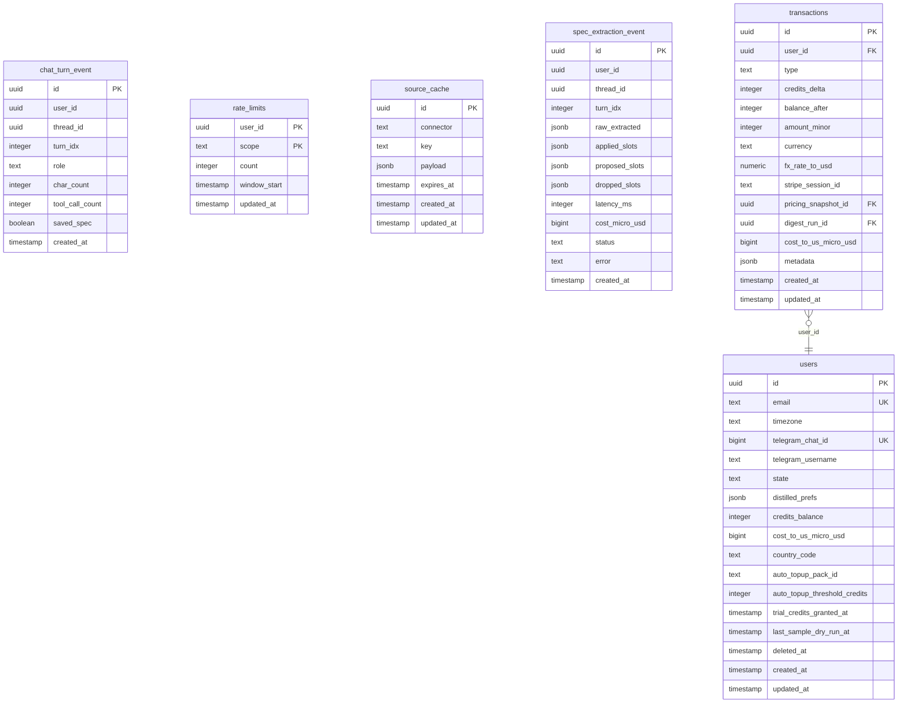

<!-- layer: knowledge · status: living · generated: drizzle (apps/web/server/db/schema.ts) @ 8afb459 · verified: 2026-10-06 -->
# Schema

Generated from drizzle (apps/web/server/db/schema.ts). Do not edit by hand: run `bun run scripts/gen-schema.ts <project-root>` and commit the result.

## Entity-relationship diagrams

### Diagram 1 of 3: account_deletions

### Diagram 2 of 3: chat_messages, chat_threads, cost_events, digest_runs, digest_specs, feedback_eval_runs, feedback_events, language_interest_events, learning_log, pricing_snapshots, rss_items, telegram_link_tokens

### Diagram 3 of 3: chat_turn_event, rate_limits, source_cache, spec_extraction_event, transactions, users

## Tables

### account_deletions

| Column | Type | Nullable | Keys | References |
| --- | --- | --- | --- | --- |
| id | uuid | no | PK | - |
| user_id | uuid | no | - | - |
| email | text | no | - | - |
| reason | text | yes | - | - |
| created_at | timestamp | no | - | - |

### chat_messages

| Column | Type | Nullable | Keys | References |
| --- | --- | --- | --- | --- |
| id | uuid | no | PK | - |
| thread_id | uuid | no | FK | chat_threads.id |
| role | text | no | - | - |
| content | jsonb | no | - | - |
| archived_at | timestamp | yes | - | - |
| created_at | timestamp | no | - | - |
| updated_at | timestamp | no | - | - |

### chat_threads

| Column | Type | Nullable | Keys | References |
| --- | --- | --- | --- | --- |
| id | uuid | no | PK | - |
| user_id | uuid | no | FK | users.id |
| purpose | text | no | - | - |
| status | text | no | - | - |
| draft_spec | jsonb | yes | - | - |
| template_id | text | yes | - | - |
| spec_id | uuid | yes | FK | digest_specs.id |
| created_at | timestamp | no | - | - |
| updated_at | timestamp | no | - | - |

### chat_turn_event

| Column | Type | Nullable | Keys | References |
| --- | --- | --- | --- | --- |
| id | uuid | no | PK | - |
| user_id | uuid | no | - | - |
| thread_id | uuid | no | - | - |
| turn_idx | integer | no | - | - |
| role | text | no | - | - |
| char_count | integer | no | - | - |
| tool_call_count | integer | no | - | - |
| saved_spec | boolean | no | - | - |
| created_at | timestamp | no | - | - |

### cost_events

| Column | Type | Nullable | Keys | References |
| --- | --- | --- | --- | --- |
| id | uuid | no | PK | - |
| user_id | uuid | yes | FK | users.id |
| digest_run_id | uuid | yes | FK | digest_runs.id |
| kind | text | no | - | - |
| provider | text | no | - | - |
| input_tokens | integer | yes | - | - |
| output_tokens | integer | yes | - | - |
| cost_usd | numeric | no | - | - |
| created_at | timestamp | no | - | - |
| updated_at | timestamp | no | - | - |

### digest_runs

| Column | Type | Nullable | Keys | References |
| --- | --- | --- | --- | --- |
| id | uuid | no | PK | - |
| user_id | uuid | no | FK | users.id |
| spec_id | uuid | no | FK | digest_specs.id |
| status | text | no | - | - |
| run_date | date | no | - | - |
| delivery_minute_utc | timestamp | yes | - | - |
| delivery_calendar_day_local | date | yes | - | - |
| attempt_count | integer | no | - | - |
| last_error | text | yes | - | - |
| sources_bundle | jsonb | yes | - | - |
| composed_markdown | text | yes | - | - |
| short_id | text | yes | - | - |
| telegram_message_id | bigint | yes | - | - |
| cost_usd | numeric | yes | - | - |
| error | text | yes | - | - |
| metadata | jsonb | no | - | - |
| created_at | timestamp | no | - | - |
| updated_at | timestamp | no | - | - |

### digest_specs

| Column | Type | Nullable | Keys | References |
| --- | --- | --- | --- | --- |
| id | uuid | no | PK | - |
| user_id | uuid | no | FK | users.id |
| version | integer | no | - | - |
| spec | jsonb | no | - | - |
| is_current | boolean | yes | - | - |
| status | text | no | - | - |
| name | text | no | - | - |
| scheduling | jsonb | no | - | - |
| next_run_at | timestamp | yes | - | - |
| paused_at | timestamp | yes | - | - |
| archived_at | timestamp | yes | - | - |
| created_via | text | no | - | - |
| is_smoke | boolean | no | - | - |
| keyboard_enabled | boolean | no | - | - |
| tier | text | no | - | - |
| searcher | text | no | - | - |
| template_id | text | yes | - | - |
| created_at | timestamp | no | - | - |
| updated_at | timestamp | no | - | - |

### feedback_eval_runs

| Column | Type | Nullable | Keys | References |
| --- | --- | --- | --- | --- |
| user_id | uuid | no | PK, FK | users.id |
| window_end_date | date | no | PK | - |
| window_days | integer | no | - | - |
| briefs_delivered_count | integer | no | - | - |
| keyboard_taps_count | integer | no | - | - |
| engagement_rate | numeric | yes | - | - |
| positive_rate | numeric | yes | - | - |
| tune_commands_count | integer | no | - | - |
| distilled_prefs_present | boolean | no | - | - |
| last_brief_at | timestamp | yes | - | - |
| last_tap_at | timestamp | yes | - | - |
| computed_at | timestamp | no | - | - |
| created_at | timestamp | no | - | - |
| updated_at | timestamp | no | - | - |

### feedback_events

| Column | Type | Nullable | Keys | References |
| --- | --- | --- | --- | --- |
| id | uuid | no | PK | - |
| user_id | uuid | no | FK | users.id |
| digest_run_id | uuid | no | FK | digest_runs.id |
| signal_type | text | yes | - | - |
| vote | text | yes | - | - |
| telegram_callback_id | text | yes | - | - |
| source | text | no | - | - |
| created_at | timestamp | no | - | - |
| updated_at | timestamp | no | - | - |

### language_interest_events

| Column | Type | Nullable | Keys | References |
| --- | --- | --- | --- | --- |
| id | uuid | no | PK | - |
| user_id | uuid | no | FK | users.id |
| language_code | text | no | - | - |
| email | text | yes | - | - |
| created_at | timestamp | no | - | - |

### learning_log

| Column | Type | Nullable | Keys | References |
| --- | --- | --- | --- | --- |
| id | uuid | no | PK | - |
| user_id | uuid | no | FK | users.id |
| source | text | no | - | - |
| raw_text | text | no | - | - |
| distilled_at | timestamp | yes | - | - |
| consumed_at | timestamp | yes | - | - |
| created_at | timestamp | no | - | - |
| updated_at | timestamp | no | - | - |

### pricing_snapshots

| Column | Type | Nullable | Keys | References |
| --- | --- | --- | --- | --- |
| id | uuid | no | PK | - |
| pack_id | text | no | - | - |
| credits | integer | no | - | - |
| price_minor_usd | integer | no | - | - |
| price_minor_myr | integer | no | - | - |
| fx_rate_usd_to_myr | numeric | no | - | - |
| cost_to_us_micro_per_credit | bigint | no | - | - |
| active_from | timestamp | no | - | - |
| active_to | timestamp | yes | - | - |
| created_at | timestamp | no | - | - |
| updated_at | timestamp | no | - | - |

### rate_limits

| Column | Type | Nullable | Keys | References |
| --- | --- | --- | --- | --- |
| user_id | uuid | no | PK | - |
| scope | text | no | PK | - |
| count | integer | no | - | - |
| window_start | timestamp | no | - | - |
| updated_at | timestamp | no | - | - |

### rss_items

| Column | Type | Nullable | Keys | References |
| --- | --- | --- | --- | --- |
| id | uuid | no | PK | - |
| spec_id | uuid | no | FK | digest_specs.id |
| feed_url | text | no | - | - |
| guid | text | no | - | - |
| title | text | no | - | - |
| url | text | no | - | - |
| published_at | timestamp | yes | - | - |
| summary | text | yes | - | - |
| created_at | timestamp | no | - | - |
| updated_at | timestamp | no | - | - |

### source_cache

| Column | Type | Nullable | Keys | References |
| --- | --- | --- | --- | --- |
| id | uuid | no | PK | - |
| connector | text | no | - | - |
| key | text | no | - | - |
| payload | jsonb | no | - | - |
| expires_at | timestamp | no | - | - |
| created_at | timestamp | no | - | - |
| updated_at | timestamp | no | - | - |

### spec_extraction_event

| Column | Type | Nullable | Keys | References |
| --- | --- | --- | --- | --- |
| id | uuid | no | PK | - |
| user_id | uuid | no | - | - |
| thread_id | uuid | no | - | - |
| turn_idx | integer | no | - | - |
| raw_extracted | jsonb | no | - | - |
| applied_slots | jsonb | no | - | - |
| proposed_slots | jsonb | no | - | - |
| dropped_slots | jsonb | no | - | - |
| latency_ms | integer | yes | - | - |
| cost_micro_usd | bigint | yes | - | - |
| status | text | no | - | - |
| error | text | yes | - | - |
| created_at | timestamp | no | - | - |

### telegram_link_tokens

| Column | Type | Nullable | Keys | References |
| --- | --- | --- | --- | --- |
| id | uuid | no | PK | - |
| user_id | uuid | no | FK | users.id |
| token | text | no | UNIQUE | - |
| expires_at | timestamp | no | - | - |
| consumed_at | timestamp | yes | - | - |
| created_at | timestamp | no | - | - |
| updated_at | timestamp | no | - | - |

### transactions

| Column | Type | Nullable | Keys | References |
| --- | --- | --- | --- | --- |
| id | uuid | no | PK | - |
| user_id | uuid | no | FK | users.id |
| type | text | no | - | - |
| credits_delta | integer | no | - | - |
| balance_after | integer | no | - | - |
| amount_minor | integer | yes | - | - |
| currency | text | yes | - | - |
| fx_rate_to_usd | numeric | yes | - | - |
| stripe_session_id | text | yes | - | - |
| pricing_snapshot_id | uuid | yes | FK | pricing_snapshots.id |
| digest_run_id | uuid | yes | FK | digest_runs.id |
| cost_to_us_micro_usd | bigint | yes | - | - |
| metadata | jsonb | no | - | - |
| created_at | timestamp | no | - | - |
| updated_at | timestamp | no | - | - |

### users

| Column | Type | Nullable | Keys | References |
| --- | --- | --- | --- | --- |
| id | uuid | no | PK | - |
| email | text | no | UNIQUE | - |
| timezone | text | no | - | - |
| telegram_chat_id | bigint | yes | UNIQUE | - |
| telegram_username | text | yes | - | - |
| state | text | no | - | - |
| distilled_prefs | jsonb | yes | - | - |
| credits_balance | integer | no | - | - |
| cost_to_us_micro_usd | bigint | no | - | - |
| country_code | text | yes | - | - |
| auto_topup_pack_id | text | yes | - | - |
| auto_topup_threshold_credits | integer | yes | - | - |
| trial_credits_granted_at | timestamp | yes | - | - |
| last_sample_dry_run_at | timestamp | yes | - | - |
| deleted_at | timestamp | yes | - | - |
| created_at | timestamp | no | - | - |
| updated_at | timestamp | no | - | - |

## Policies and roles

none found in schema files
